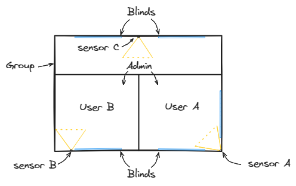

<div align="center">

# Smart Blinds

Simple auto blinds framework demo

</div>

## Development

**Option 1: One click start**

For develop frontend or embedded side, could try one click start:

```bash
python run.py
```

**Option 2: Manual start**

To start the server, you will need `Rust` installed on your machine. Then, run
the following command:

```bash
cargo run --package lumisync-server --bin server
```

To work on the web application, you should have `Node.js(LTS version)` and `npm`
installed. Then, run the following command:

```bash
npm install
npm run web
```

**Database setup**

1. Create the database (require url format, for example `sqlite:debug.db`) and
   add migration script.

```bash
sqlx database create --database-url <url>
sqlx migrate add <name>
```

2. Check the new migration script under `migrations/<timestamp>-<name>.sql`. Add
   custom database schema changes to this file.

```sql
-- Insert sample data into 'groups'
INSERT INTO groups (name) VALUES ('sample');

-- Insert sample data into 'users'
-- Password: test
INSERT INTO users (group_id, email, password, role) VALUES (1, 'test@test.com', '$argon2id$v=19$m=19456,t=2,p=1$zk5JmuovvG7B6vyGGmLxDQ$qoqCpKkqrgoVjeTGa5ewrqFpuPUisTCDnEiPz6Dh/oc', 'admin');

-- Insert sample data into 'regions'
INSERT INTO regions (group_id, name, light, temperature) VALUES (1, 'Living Room', 6, 22.5);

-- Insert sample data into 'settings'
INSERT INTO settings (user_id, light, temperature) VALUES (1, 6, 22.5);

-- Insert sample data into 'windows'
INSERT INTO windows (region_id, name, state) VALUES (1, 'Living Room Right Window', 0);

-- Insert sample data into 'sensors'
INSERT INTO sensors (region_id, name) VALUES (1, 'SENSOR-MOCK');

-- Insert sample data into 'users_regions_link'
INSERT INTO users_regions_link (user_id, region_id) VALUES (1, 1);

-- Insert sample data into 'regions_sensors_link'
INSERT INTO regions_sensors_link (region_id, sensor_id) VALUES (1, 1);
```

3. Adjust config file for `configs/development.toml` with database url.

```toml
[database]
migration_path = "migrations"
clean_start = true # or false - it dependenies on your migration
url = "<url>"
```

**Connect service provider**

1. For connecting to sensor service provider, gateway related setting need be
adjusted:

```toml
[gateway]
host = "...amazonaws.com"
port = 8883

[gateway.topic]
prefix_type = "json"
prefix_mode = "pr"
prefix_country = "fi"

[gateway.auth]
cert_path = "configs/cloud.pem" # Replace with your certification
key_path = "configs/cloud.key" # Replace with your private key
```

2. Modified the group name by new migration or edit the database directly:

```sql
UPDATE groups SET name = 'MY_CUSTOMER_ID' WHERE id = 1;
```

## Assembly

The ideal way to assemble the sensor and blinds.



### Materials

* 2x Arduino * (nano)
* 28BYJ-48 stepper motor
* Light dependent resistor(LDR) + Resistor for LDR
* NTC resistor + Resistor for NTC

### Procedural

Build up environment collector sensor. 

## Design

A user group include a group of users and a group of sensors, each user able to
control one or multiple windows, each window above link multiple sensors as data
source.

```mermaid
erDiagram

groups { int id "PK" string name "UK" }
users { int id "PK" int group_id "FK" string email "UK" string password string role }
regions { int id "PK" int group_id "FK" string name "UK" int light float temperature }
settings { int id "PK" int user_id "FK" int light float temperature }
windows { int id "PK" int region_id "FK" string name "UK" float state }
sensors { int id "PK" int region_id "FK" string name "UK" }
sensor_data { int id "PK" int sensor_id "FK" int light float temperature datetime time }
users_regions_link { int id "PK" int user_id "FK" int region_id "FK" }
regions_sensors_link { int id "PK" int region_id "FK" int sensor_id "FK" }

groups ||--|{ users : "group_id"
groups ||--|{ regions : "group_id"
users ||--|{ settings : "user_id"
regions ||--o{ windows: "region_id"
regions ||--|{ sensors : "region_id"
users ||--|{ users_regions_link : "user_id"
regions ||--|{ users_regions_link : "region_id"
sensors ||--o{ sensor_data : "sensor_id"
regions ||--|{ regions_sensors_link : "region_id"
sensors ||--|{ regions_sensors_link : "sensor_id"
```
